# SSVEP_EEG_FBCCA_(WCHAIR)

EEG-based ROS 2 control of a `turtlesim` robot using SSVEP and filter-bank
canonical correlation analysis (FBCCA).

<p align="center">
  
</p>

<p align="center"><em>Result of controlling turtlesim with EEG signals.</em></p>

> [!WARNING]
> This is a research and simulation prototype. Test with turtlesim or an
> unloaded robot. It is not a safety controller for a powered wheelchair.

## 1. Baseline Results

The results in this section use the original FBCCA path:

The full timing-statistics report is available in
[`supplementary_resources/timing_statistics.md`](supplementary_resources/timing_statistics.md).

```yaml
use_score_margin: false
use_trained_model: false
```

No score-margin filter or trained model is active in these measurements.

### 1.1 Switching Latency

Definitions for the table:

- `Normal trials`: normal trials / total trials. A normal trial has the
  expected command as the first FBCCA candidate and reaches `valid=true` within
  `0.8 s` of that correct candidate. This is a trial filter, not a window
  accuracy measure.
- `First EEG -> cmd_vel mean`: mean time from the first recorded `/eeg/frame`
  to the first matching `/turtle1/cmd_vel` across normal trials.
- `Correct FBCCA -> cmd_vel mean`: mean time from the first correct FBCCA
  candidate to the matching `/turtle1/cmd_vel`.
- `Variance`: sample variance in seconds squared, using denominator `n - 1`.

| Command | Normal trials | First EEG -> cmd_vel mean | Variance | Correct FBCCA -> cmd_vel mean | Variance |
|---|---:|---:|---:|---:|---:|
| forward | 6/10 | 4.731 s | 0.025132 | 0.456 s | 0.001274 |
| backward | 4/10 | 4.720 s | 0.054528 | 0.435 s | 0.000739 |
| left | 4/4 | 4.505 s | 0.023268 | 0.439 s | 0.000307 |
| right | 4/4 | 4.742 s | 0.049954 | 0.433 s | 0.000683 |
| stop | 4/4 | 4.665 s | 0.016971 | 0.465 s | 0.000376 |

`update_period=0.4 s` is the interval between classification attempts. A
normal first output contains approximately:

```text
4.0 s window fill
+ 0-0.4 s timer phase
+ approximately 0.4 s for the second consistent result
+ approximately 0-0.1 s command publication
= approximately 4.4-4.9 s
```

The measured mean is not restricted to multiples of `0.4 s` because each
trial starts with a different timer phase and message arrival time. The
`Correct FBCCA -> cmd_vel` mean excludes window filling and mainly measures
confirmation plus command publication.

#### Long-delay example

This is the recorded `single_backward_01` trial. It is not included in the
normal-trial mean. Times are relative to the first recorded `/eeg/frame`.

| Event | Time | Meaning |
|---|---:|---|
| First `/eeg/frame` | 0.000 s | Measurement origin |
| 4-second window ready | 4.066 s | 1000 EEG samples available |
| First candidate | 4.140 s | `right`, `valid=false`, `low_confidence` |
| Correct candidate | 4.935 s | `backward`, `valid=false`, `low_confidence` |
| Valid backward | 7.736 s | `backward`, `valid=true` |
| Matching `cmd_vel` | 7.743 s | `linear.x=-1.000` |

The recorded evidence shows that the first correct candidate was rejected for
low confidence. The rosbag does not expose every intermediate classifier
decision, so the remaining 2.801 s cannot be assigned to a specific internal
decision beyond the recorded threshold/confirmation logic. The measured
intervals are:

```text
first EEG -> window ready = 4.066 s
window ready -> first candidate = 0.074 s
first candidate -> valid backward = 3.596 s
valid backward -> cmd_vel = 0.007 s
```

### 1.2 Personalized Confidence Thresholds

For six FBCCA scores `score(k)`, the selected candidate's confidence is:

```text
confidence(c) = max(score(c), 0) / sum(max(score(k), 0))
```

This is a normalized score, not a probability. The classifier selects the
highest FBCCA score, looks up the threshold for that selected command, and
requires two consistent results before publishing `valid=true`.

The current thresholds are configured in
[`eeg.yaml`](src/eeg_bci/config/eeg.yaml). They were selected as an operating
point from recorded confidence distributions: retain usable correct candidates
while rejecting weak candidates. They are not learned model parameters.

Definitions for the calibration table:

- `Threshold`: configured per-command minimum confidence.
- `Correct n`: windows where the expected command and raw FBCCA candidate are
  the same.
- `Correct p10`: 10th percentile of confidence in those correct windows.
- `Correct pass`: percentage of correct windows with confidence at least the
  configured threshold.
- `Unknown n`: no-target windows whose raw candidate is the listed command.
- `Unknown pass`: percentage of those unknown candidate windows above the
  threshold. This is before consecutive confirmation and is not final false
  command rate.

| Candidate | Threshold | Correct n | Correct p10 | Correct pass | Unknown n | Unknown pass |
|---|---:|---:|---:|---:|---:|---:|
| `forward` | 0.23 | 107 | 0.227 | 87.9% | 459 | 61.4% |
| `backward` | 0.22 | 132 | 0.247 | 97.0% | 258 | 77.9% |
| `left` | 0.24 | 118 | 0.222 | 78.0% | 275 | 34.5% |
| `right` | 0.25 | 106 | 0.226 | 75.5% | 126 | 32.5% |
| `stop` | 0.20 | 116 | 0.237 | 100.0% | 131 | 90.1% |
| `idle` | 0.24 | 93 | 0.221 | 81.7% | 55 | 21.8% |

The high unknown-pass values show that confidence alone cannot reject all
closed-eyes or free-view windows. The current baseline therefore also relies
on consecutive confirmation. `score_margin_threshold` and
`model_reject_probability_*` are inactive while the two switches above are
`false`.

### 1.3 Raw FBCCA Command Accuracy

Definitions for the table:

- `Single trials` / `All trials`: number of recordings in each stimulation
  mode.
- `Single windows` / `All windows`: number of 4-second analysis windows.
- `Raw accuracy`: percentage of windows whose highest FBCCA frequency matches
  the expected command.
- `Overall trials` / `Overall windows`: counts after combining both modes.
- `Majority-trial accuracy`: percentage of trials where the most frequent raw
  candidate is the expected command.

| Command | Single trials | Single windows | Single raw accuracy | All trials | All windows | All raw accuracy | Overall trials | Overall windows | Overall raw accuracy | Majority-trial accuracy |
|---|---:|---:|---:|---:|---:|---:|---:|---:|---:|---:|
| forward | 5 | 192 | 92.71% | 5 | 193 | 96.89% | 10 | 385 | 94.81% | 100.00% |
| backward | 5 | 193 | 63.73% | 5 | 192 | 64.58% | 10 | 385 | 64.16% | 90.00% |
| left | 2 | 76 | 97.37% | 2 | 76 | 100.00% | 4 | 152 | 98.68% | 100.00% |
| right | 2 | 78 | 100.00% | 2 | 77 | 97.40% | 4 | 155 | 98.71% | 100.00% |
| stop | 2 | 76 | 84.21% | 2 | 76 | 73.68% | 4 | 152 | 78.95% | 75.00% |

Overall raw window accuracy is `1035/1229 = 84.21%`. A 100% majority-trial
value does not mean every window was correct; it means the expected command was
the majority candidate in every trial in that group.

### 1.4 No-Target Conditions

Plain FBCCA always selects one of its six reference frequencies. It has no
native unknown class at the raw-score stage.

Definitions for the table:

- `Trials`: number of recordings for the condition.
- `FBCCA decisions`: number of analyzed windows.
- `Raw rejection rate`: percentage of windows rejected before a candidate is
  selected.
- `Most common raw candidate`: candidate with the largest count.
- `Raw candidate distribution`: percentage of windows assigned to each
  candidate.
- `Mean confidence`: mean normalized top score.
- `Valid=true false accepts`: valid outputs produced during a no-target trial.
- `False-acceptance rate`: `Valid=true false accepts / FBCCA decisions`.
- `Trials with false accept`: trials containing at least one false valid output.

| Condition | Trials | FBCCA decisions | Raw rejection rate | Most common raw candidate | Raw candidate distribution | Mean confidence | Valid=true false accepts | False-acceptance rate | Trials with false accept |
|---|---:|---:|---:|---|---|---:|---:|---:|---:|
| close_eyes | 2 | 76 | 0.00% | backward | forward 11.84%, backward 51.32%, left 13.16%, right 19.74%, stop 3.95%, idle 0.00% | 0.266 | 49 | 64.47% | 2/2 |
| free_view | 2 | 76 | 0.00% | forward | forward 53.95%, backward 3.95%, left 23.68%, right 5.26%, stop 5.26%, idle 7.89% | 0.242 | 35 | 46.05% | 2/2 |

Closed eyes can increase alpha-band activity near the 11 Hz backward reference.
Free view changes gaze and attention across the stimulus screen and embedded
turtlesim feedback. In both cases, FBCCA can produce a command candidate even
without a target.

<p align="center">
  
</p>

<table>
  <tr>
    <td align="center"><strong>Free view</strong><br></td>
    <td align="center"><strong>Closed eyes</strong><br></td>
  </tr>
</table>

## 2. Architecture

```mermaid
flowchart LR
    A["8-channel BLE EEG<br/>250 Hz"] --> B["ble_to_lsl.py"]
    B --> C["LSL EEG stream"]
    C --> D["lsl_to_ros2.py"]
    D --> E["/eeg/frame<br/>EEGFrame"]
    D --> F["/eeg/quality<br/>SignalQuality"]
    E --> G["ssvep_classifier.py"]
    F --> G
    G --> H["4 s window<br/>1000 samples"]
    H --> I["3 filter banks"]
    I --> J["CCA references<br/>4 harmonics"]
    J --> K["Six FBCCA scores"]
    K --> L["Threshold +<br/>two confirmations"]
    L --> M["/ssvep/command"]
    M --> N["ssvep_to_turtlesim.py"]
    N --> O["/turtle1/cmd_vel"]
    O --> P["turtlesim"]
    P --> Q["/turtle1/pose"]
    Q --> N
    Q --> R["PsychoPy feedback"]
```



### 2.1 Concepts

- **SSVEP**: an EEG response at the frequency and harmonics of a flickering
  visual target.
- **FBCCA**: filters each EEG window into several bands, correlates each band
  with sine/cosine references, weights the correlations, and selects the
  highest command score.
- **Confidence**: normalized top FBCCA score. It is not a calibrated
  probability.
- **Confirmation**: the same candidate must pass two consecutive classification
  cycles before `valid=true`.

### 2.2 Command Mapping

| Frequency | Command | Stimulus position |
|---:|---|---|
| 8 Hz | `forward` | bottom-left |
| 9 Hz | `left` | top-right |
| 10 Hz | `right` | bottom-right |
| 11 Hz | `backward` | top-left |
| 12 Hz | `stop` | bottom-center |
| 13 Hz | `idle` | classifier target |

```text
backward    turtlesim    left
forward     stop         right
```

`forward` and `backward` set `linear.x`. `left` and `right` set `angular.z`.
The current demonstration uses `|linear.x / angular.z| = 1.0 / 1.5 = 0.67`
when both components are active.

### 2.3 Code Layout

```text
eeg/
├── README.md
├── requirements.txt
├── start_eeg_turtlesim.sh
├── supplementary_resources/
├── eeg_rosbag/
└── src/
    ├── eeg_interfaces/msg/
    └── eeg_bci/
        ├── config/eeg.yaml
        ├── launch/
        └── eeg_bci/
            ├── ble_to_lsl.py
            ├── lsl_to_ros2.py
            ├── ssvep_classifier.py
            ├── ssvep_stimulus.py
            ├── ssvep_to_turtlesim.py
            ├── ssvep_to_cmd_vel.py
            └── motion_controller.py
```

## 3. Reproduction

### 3.1 Requirements

- Ubuntu 22.04
- ROS 2 Humble
- Python 3.10
- Eight-channel BLE EEG headband; tested device: `VIS_BCI_DFED857C`
- Bluetooth, PsychoPy, Linux LSL runtime, and `turtlesim`
- Display capable of presenting the 8-13 Hz stimuli

### 3.2 Install and Build

```bash
git clone https://github.com/Yongying-Zhu/SSVEP_EEG_FBCCA_WCHAIR.git
cd SSVEP_EEG_FBCCA_WCHAIR

source /opt/ros/humble/setup.bash
/usr/bin/python3 -m venv --system-site-packages .venv
source .venv/bin/activate
python -m pip install -r requirements.txt
colcon build --symlink-install
source install/setup.bash
```

### 3.3 Start

```bash
source /opt/ros/humble/setup.bash
source .venv/bin/activate
source install/setup.bash
./start_eeg_turtlesim.sh
```

The launcher starts BLE, LSL, ROS 2, FBCCA, turtlesim, the motion bridge, and
the PsychoPy stimulus. Parameters are loaded from
`src/eeg_bci/config/eeg.yaml`. Stop with `Ctrl+C`.

Useful topics:

```bash
ros2 topic echo /eeg/quality
ros2 topic echo /ssvep/command
ros2 topic echo /turtle1/cmd_vel
ros2 topic echo /turtle1/pose
```

### 3.4 Record and Replay

```bash
ros2 bag record -o experiments/forward_01 \
  /eeg/frame /eeg/quality /ssvep/command \
  /turtle1/cmd_vel /turtle1/pose /ssvep/stimulus_active
```

Replay EEG frames into a running classifier:

```bash
ros2 bag play eeg_rosbag/forward_01 --topics /eeg/frame --rate 1.0
```

Analyze a command timeline:

```bash
ros2 run eeg_bci analyze_command_timeline \
  --bag experiments/forward/single_forward_02
```

Run offline FBCCA analysis without training:

```bash
ros2 run eeg_bci analyze_rosbags \
  --input-root /path/to/flat_rosbags \
  --output-dir /tmp/eeg_analysis \
  --no-train
```

## 4. Limitations

- Raw FBCCA always selects one of its reference frequencies; it has no native
  unknown class.
- Reported timing starts at the first ROS-recorded `/eeg/frame`, not at the
  physical EEG sampling instant.
- Current rosbag data show small sequence gaps, so exact device-to-command
  latency cannot be separated from BLE, LSL, ROS, and recording delays.
- The project is a turtlesim demonstrator and requires an independent emergency
  stop for any physical robot.
