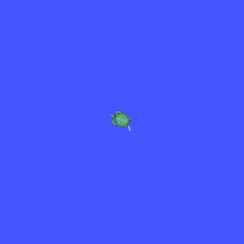
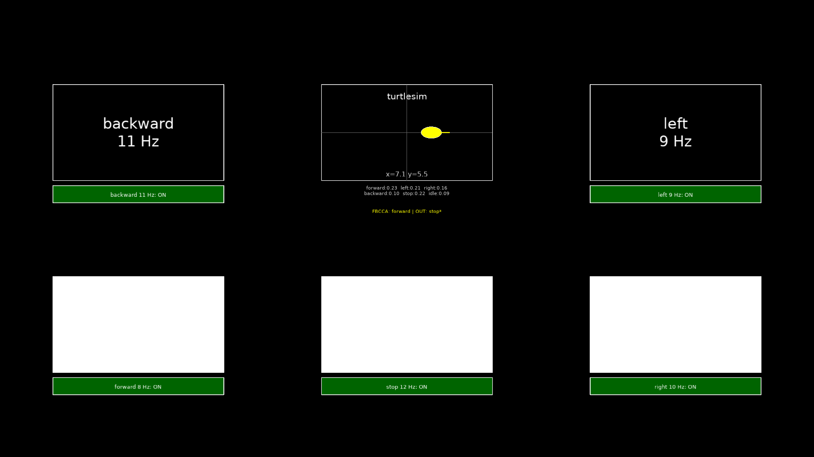
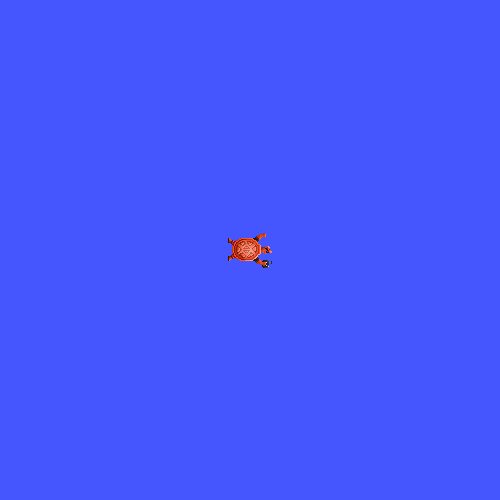
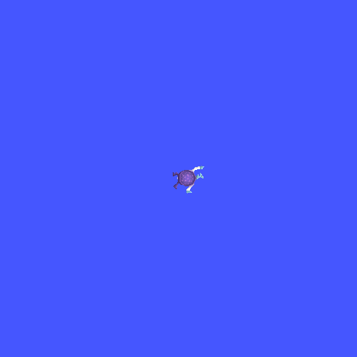

<h1 align="center">
  
</h1>

<p align="center">
  
</p>

<p align="center">
  
</p>

<p align="center"><em>Result of controlling turtlesim with EEG signals.</em></p>

> [!WARNING]
> This is a research and simulation prototype. Test with turtlesim or an
> unloaded robot. It is not a safety controller for a powered wheelchair.

## 1. Baseline Results

Based on the four `/turtle1/cmd_vel` switching medians, the current turtlesim control frequency is approximately **0.249 Hz**: `(4.556 + 4.282 + 3.388 + 3.853) / 4 = 4.01975 s` per switch, so `1 / 4.01975 = 0.2488 Hz`.

| Switching: raw FBCCA majority-confirmation delay | Successful bags | Mean (s) | Median (s) | Variance (s^2) |
|---|---:|---:|---:|---:|
| forward -> backward | 9/10 | 4.443 | 4.129 | 1.668 |
| backward -> left | 10/10 | 4.050 | 4.050 | 1.136 |
| left -> right | 9/10 | 2.976 | 2.949 | 0.503 |
| right -> stop | 7/10 | 3.469 | 3.296 | 2.260 |

| Switching: valid `/ssvep/command` output delay | Successful bags | Mean (s) | Median (s) | Variance (s^2) |
|---|---:|---:|---:|---:|
| forward -> backward | 7/10 | 4.705 | 4.528 | 1.023 |
| backward -> left | 8/10 | 4.331 | 4.242 | 0.993 |
| left -> right | 7/10 | 3.646 | 3.348 | 0.703 |
| right -> stop | 6/10 | 3.459 | 3.818 | 1.710 |

| Switching: matching `/turtle1/cmd_vel` output delay | Successful bags | Mean (s) | Median (s) | Variance (s^2) |
|---|---:|---:|---:|---:|
| forward -> backward | 7/10 | 4.738 | 4.556 | 1.052 |
| backward -> left | 8/10 | 4.367 | 4.282 | 0.980 |
| left -> right | 7/10 | 3.686 | 3.388 | 0.689 |
| right -> stop | 6/10 | 3.492 | 3.853 | 1.711 |

Let `W=4 s` be the sliding-window length, `Delta=0.4 s` the classification
period, `m=2` the required number of consistent results, `phi` the timer phase,
and `delta` the bridge publication delay:

```text
0 <= phi < Delta
0 <= delta <= 0.1 s
T_confirmation = (m - 1) * Delta = 0.4 s
T_switch = T_replace + phi + T_confirmation + delta
0 <= T_replace <= W
0.4 s <= T_switch < 4.9 s
```

`T_replace` is the time for the new command's EEG evidence to make the mixed
4-second window discriminative. For the `/turtle1/cmd_vel` medians, the
combined median is:

```text
T_cmd_vel,median = (4.556 + 4.282 + 3.388 + 3.853) / 4
                  = 4.01975 s
```

Using the midpoint timer phase `0.2 s`, the `0.4 s` confirmation interval,
and an average `0.05 s` bridge delay gives:

```text
T_replace,median ~= 4.01975 - 0.2 - 0.4 - 0.05
                 = 3.36975 s
```

Therefore the measured 3-5 s range is expected: the window replacement term
is approximately 2.7-3.9 s in the four transitions, and the fixed processing
terms add approximately 0.6-0.9 s. The theoretical conservative upper bound
is `4.9 s`.

#### Synthetic forward -> backward slice

To isolate the sliding-window effect, a temporary bag was formed from the first
13 seconds of `forward_01`, followed by `backward_01` at a point where
`backward` was already stably valid. Logic regression and margin rejection were
disabled. Times below start at the synthetic cut:

| Event | Time after cut |
|---|---:|
| First raw FBCCA=`backward` candidate | 3.950 s |
| Valid `/ssvep/command`=`backward` | 5.951 s |
| Matching `/turtle1/cmd_vel` | 6.020 s |

The candidate sequence was `backward` (3.950 s), `forward` (4.356 s),
`backward` (4.751 s), `forward` (5.152 s), and `backward` (5.549 s and
5.951 s). The intervening `forward` candidates reset the two-result
confirmation, so `5.951 - 3.950 = 2.001 s` elapsed before a valid command and
`6.020 - 5.951 = 0.069 s` before the matching velocity command.

This shows the main limitation of the 4-second sliding window: joining a
stable backward segment does not remove the old forward samples already in the
window. Mixed-window scores can alternate between commands, and every
inconsistent result restarts confirmation. The delay therefore depends on
window composition and candidate stability, not only on the nominal `0.4 s`
classification period.

<h3>
  
</h3>

`rosbag/switch_process/switch_01` through `switch_10` are the ten recordings;
each uses `forward -> backward -> left -> right -> stop`.
`Successful bags` is successful recordings / ten recordings. The time starts
when the previous command phase ends and ends at the event named in the table
header. Thus, the three tables are successive endpoints of the same chain:
raw FBCCA candidate/confirmation, valid `/ssvep/command`, and matching
`/turtle1/cmd_vel`. They describe an already running classifier and exclude
the initial 4-second EEG-window loading.

`Mean` is the arithmetic mean of successful transition times. `Median` is the
middle successful transition time. `Variance` is the sample variance in
seconds squared with denominator `n - 1`.

The results in this section use the original FBCCA path with
`use_score_margin: false` and `use_trained_model: false`. The full
timing-statistics report is available in
[`supplementary_resources/timing_statistics.md`](supplementary_resources/timing_statistics.md).

### 1.1 Personalized Confidence Thresholds

The recordings under `rosbag/Initialize` contain the initial single-command
and all-command trials. Their core purpose is to estimate a suitable
per-command confidence threshold from the recorded FBCCA confidence
distributions. They are calibration data, not merely replay examples.

For six FBCCA scores `score(k)`, the selected candidate's confidence is:

```text
confidence(c) = max(score(c), 0) / sum(max(score(k), 0))
```

This is a normalized score, not a probability. The classifier selects the
highest FBCCA score, looks up the threshold for that selected command, and
requires two consistent results before publishing `valid=true`.

The current thresholds are configured in
[`eeg.yaml`](src/eeg_bci/config/eeg.yaml). They were selected as an operating
point from recorded confidence distributions: retain usable correct candidates
while rejecting weak candidates. They are not learned model parameters.

The operating point was checked experimentally. Lowering the thresholds made
turtlesim respond more often, but also caused unwanted movement under weak or
no-target EEG. Raising the thresholds, including a trial with an additional
rejection filter, improved recognition accuracy but made the controller miss
valid commands and become noticeably insensitive. The deployed values therefore
keep command-specific thresholds around the observed confidence center: their
mean is `(0.23 + 0.22 + 0.24 + 0.25 + 0.20 + 0.24) / 6 = 0.23`. This mean is a
reference operating point, not a replacement for the per-command values.

<h3>
  
</h3>

- `Threshold`: configured per-command minimum confidence.
- `Correct n`: windows where the expected command and raw FBCCA candidate are
  the same.
- `Correct p10`: 10th percentile of confidence in those correct windows.
- `Correct pass`: percentage of correct windows with confidence at least the
  configured threshold.
- `Unknown n`: no-target windows whose raw candidate is the listed command.
- `Unknown pass`: percentage of those unknown candidate windows above the
  threshold. This is before consecutive confirmation and is not final false
  command rate.

| Candidate | Threshold | Correct n | Correct p10 | Correct pass | Unknown n | Unknown pass |
|---|---:|---:|---:|---:|---:|---:|
| `forward` | 0.23 | 107 | 0.227 | 87.9% | 459 | 61.4% |
| `backward` | 0.22 | 132 | 0.247 | 97.0% | 258 | 77.9% |
| `left` | 0.24 | 118 | 0.222 | 78.0% | 275 | 34.5% |
| `right` | 0.25 | 106 | 0.226 | 75.5% | 126 | 32.5% |
| `stop` | 0.20 | 116 | 0.237 | 100.0% | 131 | 90.1% |
| `idle` | 0.24 | 93 | 0.221 | 81.7% | 55 | 21.8% |

The high unknown-pass values show that confidence alone cannot reject all
closed-eyes or free-view windows. The current baseline therefore also relies
on consecutive confirmation. `score_margin_threshold` and
`model_reject_probability_*` are inactive while the two switches above are
`false`.

### 1.2 Raw FBCCA Command Accuracy

<h3>
  
</h3>

- `Single trials` / `All trials`: number of recordings in each stimulation
  mode.
- `Single windows` / `All windows`: number of 4-second analysis windows.
- `Raw accuracy`: percentage of windows whose highest FBCCA frequency matches
  the expected command.
- `Overall trials` / `Overall windows`: counts after combining both modes.
- `Majority-trial accuracy`: percentage of trials where the most frequent raw
  candidate is the expected command.

| Command | Single trials | Single windows | Single raw accuracy | All trials | All windows | All raw accuracy | Overall trials | Overall windows | Overall raw accuracy | Majority-trial accuracy |
|---|---:|---:|---:|---:|---:|---:|---:|---:|---:|---:|
| forward | 5 | 192 | 92.71% | 5 | 193 | 96.89% | 10 | 385 | 94.81% | 100.00% |
| backward | 5 | 193 | 63.73% | 5 | 192 | 64.58% | 10 | 385 | 64.16% | 90.00% |
| left | 2 | 76 | 97.37% | 2 | 76 | 100.00% | 4 | 152 | 98.68% | 100.00% |
| right | 2 | 78 | 100.00% | 2 | 77 | 97.40% | 4 | 155 | 98.71% | 100.00% |
| stop | 2 | 76 | 84.21% | 2 | 76 | 73.68% | 4 | 152 | 78.95% | 75.00% |

Overall raw window accuracy is `1035/1229 = 84.21%`. A 100% majority-trial
value does not mean every window was correct; it means the expected command was
the majority candidate in every trial in that group.

### 1.3 No-Target Conditions

Plain FBCCA always selects one of its six reference frequencies. It has no
native unknown class at the raw-score stage.

<h3>
  
</h3>

- `Trials`: number of recordings for the condition.
- `FBCCA decisions`: number of analyzed windows.
- `Raw rejection rate`: percentage of windows rejected before a candidate is
  selected.
- `Most common raw candidate`: candidate with the largest count.
- `Raw candidate distribution`: percentage of windows assigned to each
  candidate.
- `Mean confidence`: mean normalized top score.
- `Valid=true false accepts`: valid outputs produced during a no-target trial.
- `False-acceptance rate`: `Valid=true false accepts / FBCCA decisions`.
- `Trials with false accept`: trials containing at least one false valid output.

| Condition | Trials | FBCCA decisions | Raw rejection rate | Most common raw candidate | Raw candidate distribution | Mean confidence | Valid=true false accepts | False-acceptance rate | Trials with false accept |
|---|---:|---:|---:|---|---|---:|---:|---:|---:|
| close_eyes | 2 | 76 | 0.00% | backward | forward 11.84%, backward 51.32%, left 13.16%, right 19.74%, stop 3.95%, idle 0.00% | 0.266 | 49 | 64.47% | 2/2 |
| free_view | 2 | 76 | 0.00% | forward | forward 53.95%, backward 3.95%, left 23.68%, right 5.26%, stop 5.26%, idle 7.89% | 0.242 | 35 | 46.05% | 2/2 |

Closed eyes can increase alpha-band activity near the 11 Hz backward reference.
Free view changes gaze and attention across the stimulus screen and embedded
turtlesim feedback. In both cases, FBCCA can produce a command candidate even
without a target.

<p align="center">
  
</p>

<table>
  <tr>
    <td align="center"><strong>Free view</strong><br></td>
    <td align="center"><strong>Closed eyes</strong><br></td>
  </tr>
</table>

## 2. Architecture

```mermaid
flowchart LR
    A["8-channel BLE EEG<br/>250 Hz"] --> B["ble_to_lsl.py"]
    B --> C["LSL EEG stream"]
    C --> D["lsl_to_ros2.py"]
    D --> E["/eeg/frame<br/>EEGFrame"]
    D --> F["/eeg/quality<br/>SignalQuality"]
    E --> G["ssvep_classifier.py"]
    F --> G
    G --> H["4 s window<br/>1000 samples"]
    H --> I["3 filter banks"]
    I --> J["CCA references<br/>4 harmonics"]
    J --> K["Six FBCCA scores"]
    K --> L["Threshold +<br/>two confirmations"]
    L --> M["/ssvep/command"]
    M --> N["ssvep_to_turtlesim.py"]
    N --> O["/turtle1/cmd_vel"]
    O --> P["turtlesim"]
    P --> Q["/turtle1/pose"]
    Q --> N
    Q --> R["PsychoPy feedback"]
```



### 2.1 Concepts

- **SSVEP**: an EEG response at the frequency and harmonics of a flickering
  visual target.
- **FBCCA**: filters each EEG window into several bands, correlates each band
  with sine/cosine references, weights the correlations, and selects the
  highest command score.
- **Confidence**: normalized top FBCCA score. It is not a calibrated
  probability.
- **Confirmation**: the same candidate must pass two consecutive classification
  cycles before `valid=true`.

### 2.2 Command Mapping

| Frequency | Command | Stimulus position |
|---:|---|---|
| 8 Hz | `forward` | bottom-left |
| 9 Hz | `left` | top-right |
| 10 Hz | `right` | bottom-right |
| 11 Hz | `backward` | top-left |
| 12 Hz | `stop` | bottom-center |
| 13 Hz | `idle` | classifier target |

```text
backward    turtlesim    left
forward     stop         right
```

`forward` and `backward` set `linear.x`. `left` and `right` set `angular.z`.
The current demonstration uses `|linear.x / angular.z| = 1.0 / 1.5 = 0.67`
when both components are active.

### 2.3 Code Layout

```text
eeg/
├── README.md
├── requirements.txt
├── start_eeg_turtlesim.sh
├── supplementary_resources/
├── rosbag/
│   ├── Initialize/                # initial recordings
│   └── switch_process/            # command-switch recordings
└── src/
    ├── eeg_interfaces/msg/
    └── eeg_bci/
        ├── config/eeg.yaml
        ├── launch/
        └── eeg_bci/
            ├── ble_to_lsl.py
            ├── lsl_to_ros2.py
            ├── ssvep_classifier.py
            ├── ssvep_stimulus.py
            ├── ssvep_to_turtlesim.py
            ├── ssvep_to_cmd_vel.py
            └── motion_controller.py
```

## 3. Reproduction

### 3.1 Requirements

- Ubuntu 22.04
- ROS 2 Humble
- Python 3.10
- Eight-channel BLE EEG headband; tested device: `VIS_BCI_DFED857C`
- Bluetooth, PsychoPy, Linux LSL runtime, and `turtlesim`
- Display capable of presenting the 8-13 Hz stimuli

### 3.2 Install and Build

```bash
git clone https://github.com/Yongying-Zhu/SSVEP_EEG_FBCCA_WCHAIR.git
cd SSVEP_EEG_FBCCA_WCHAIR

source /opt/ros/humble/setup.bash
/usr/bin/python3 -m venv --system-site-packages .venv
source .venv/bin/activate
python -m pip install -r requirements.txt
colcon build --symlink-install
source install/setup.bash
```

### 3.3 Start

```bash
source /opt/ros/humble/setup.bash
source .venv/bin/activate
source install/setup.bash
./start_eeg_turtlesim.sh
```

The launcher starts BLE, LSL, ROS 2, FBCCA, turtlesim, the motion bridge, and
the PsychoPy stimulus. Parameters are loaded from
`src/eeg_bci/config/eeg.yaml`. Stop with `Ctrl+C`.

Useful topics:

```bash
ros2 topic echo /eeg/quality
ros2 topic echo /ssvep/command
ros2 topic echo /turtle1/cmd_vel
ros2 topic echo /turtle1/pose
```

### 3.4 Record and Replay

```bash
ros2 bag record -o rosbag/Initialize/forward/forward_01 \
  /eeg/frame /eeg/quality /ssvep/command \
  /turtle1/cmd_vel /turtle1/pose /ssvep/stimulus_active
```

Replay EEG frames into a running classifier:

```bash
ros2 bag play /path/to/rosbag/Initialize/forward/forward_01 \
  --topics /eeg/frame --rate 1.0
```

Analyze a command timeline:

```bash
ros2 run eeg_bci analyze_command_timeline \
  --bag rosbag/Initialize/forward/forward_02
```

Run offline FBCCA analysis without training:

```bash
ros2 run eeg_bci analyze_rosbags \
  --input-root /path/to/flat_rosbags \
  --output-dir /tmp/eeg_analysis \
  --no-train
```

## 4. Limitations

- Raw FBCCA always selects one of its reference frequencies; it has no native
  unknown class.
- Reported timing starts at the first ROS-recorded `/eeg/frame`, not at the
  physical EEG sampling instant.
- Current rosbag data show small sequence gaps, so exact device-to-command
  latency cannot be separated from BLE, LSL, ROS, and recording delays.
- The project is a turtlesim demonstrator and requires an independent emergency
  stop for any physical robot.

## 5. Proposed Improvements

Current problems:

1. **Slow response:** Most outputs take more than 4 s, both at startup and
   after command switches.
2. **False movement without a target:** Closed-eyes and free-view trials can
   produce valid commands, so turtlesim may move unexpectedly.
3. **Limited generality:** Data was collected from one developer with limited
   hardware, so current thresholds and other hyperparameters are not yet
   subject- or device-independent.

Proposed directions:

1. **Tune temporal parameters:** Sweep `window_seconds` and `update_period`
   under controlled conditions. With more data, select them as hyperparameters
   using held-out validation.
2. **Reject no-target activity:** Compare voltage and FBCCA-score distributions
   for closed-eyes and free-view trials against target trials, then design the
   lightest rejection filter that reduces false movement without materially
   increasing latency.
3. **Expand the dataset:** If the first two measures are insufficient, add or
   replace hardware and collect data from more subjects to improve the
   generality of confidence thresholds and other hyperparameters.

These are proposed experiments, not validated results.
